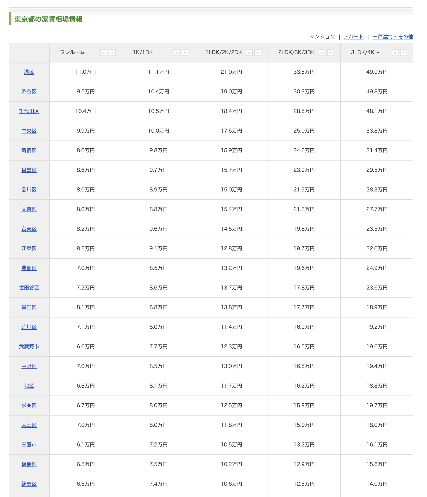
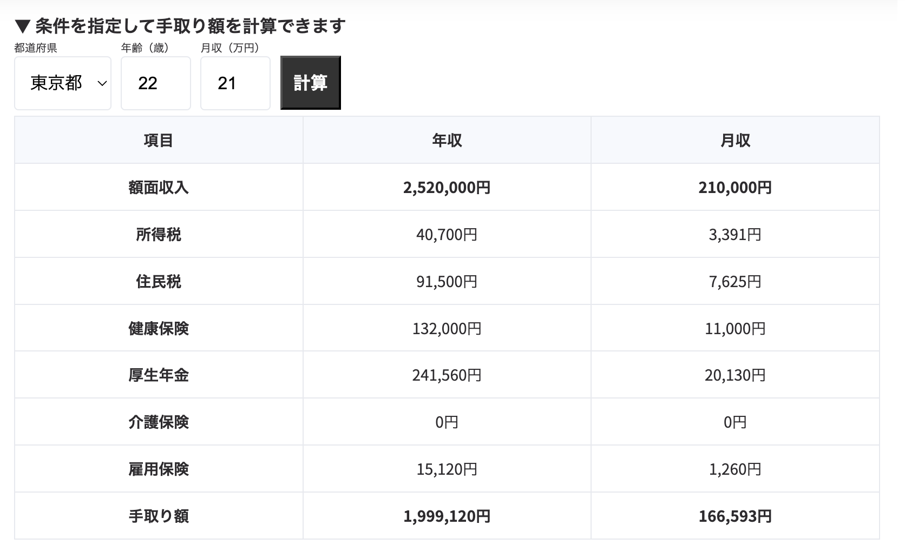
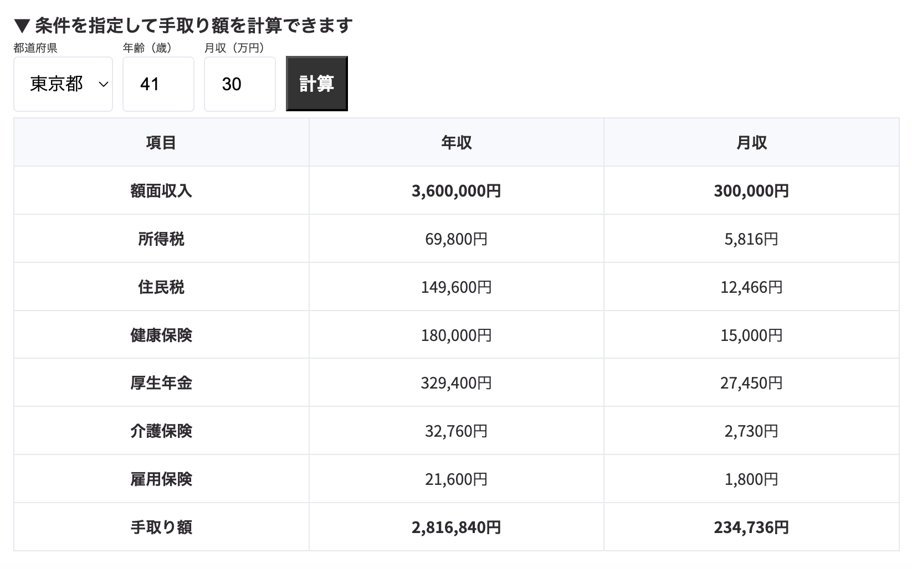

# 日本人増加計画
## 1人暮らし、2人暮らし、3人暮らし
親元離れ1人暮らしして、なんか2人になって、子供が産まれて3人になってってして行くとちょっと少子化が止まる。

### 仮のステージ
 - 1人暮らし　1K
 - 2人暮らし　1LDK
 - 3人暮らし　2LDK

としよう。

## 東京の家賃ってどんなもんなの
東京で就職しちゃったんでね、東京の会社に出社する可能性あんのよ。
という事で、東京の家賃をスーモで調べた。https://houjin.jp/
適当にまとめると
 - 練馬区、板橋区、北区あたりの埼玉隣接区が比較的安い
  1Kで7万、1LDKで10万、2LDKで13万くらい

 - 港区、千代田区、中央区あたりが高い
   1Kで10万、1LDKで19万、2LDKで28万くらい

まあ駅から徒歩30分とか、バスで15分とかそういうのも入ってるんでしょうがね。

とりあえず毎月これだけ払える収入がまずないと親元を離れることもできないのだ。

## じゃあ給料はどんなもんなの
厚生労働省が初任給の調査をしている。
https://www.mhlw.go.jp/toukei/itiran/roudou/chingin/kouzou/19/01.html
なぜか令和元年で打ち切ってるけど。

令和元年版をコピペする。

- 大学院修士課程修了	238.9千円	（対前年増減率	0.1％）
- 大学卒	210.2千円	（対前年増減率　1.7％）
- 高専・短大卒	183.9千円	（対前年増減率　1.4％）
- 高校卒	167.4千円		（対前年増減率　1.4％）

## 手取りは？
大学卒初任給21万を元にここで計算した、17万くらいだそう。
https://talentsquare.co.jp/tedori-calc-tool-monthly/

## 昇給率は？
労働政策研究・研修機構が出している。大体年に2%らしい。
https://www.jil.go.jp/kokunai/blt/backnumber/2023/10/kokunai_01.html

仮に大卒21万円の月収をベースに2%の上昇率で計算すると月収30万円を超えるのは19年後の41歳である。
手取りを計算すると大体23万円である。40歳超えると介護保険が乗ってくる。

練馬区あたりで2LDKを借りて過ごせば月に10万円使える。
実際のところ賃貸って家賃以外にも支払い発生するので10万円は割るだろうけど。

## 日本人は増えるのか？
41歳の大卒社会人が結婚し、月10万円で夫婦と子供3人を養えれば増える。
もしくは東京に会社に出勤させなければ増える。出勤はカス。東京で高い家賃出してオフィス借りるのをやめよう。それか関東の家賃を下げてくれ。敷金礼金、管理費の他に、火災保険とか家賃保証とかサイレント家賃が被さって結局15万くらいとかなるわけですよ。

# 言いたい事
家賃高えんだよ