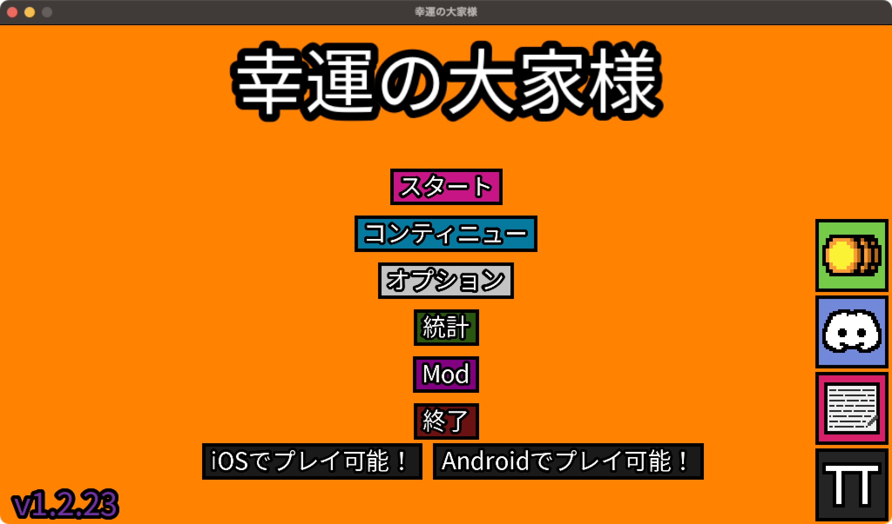
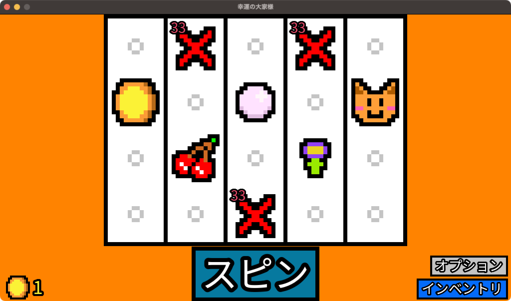
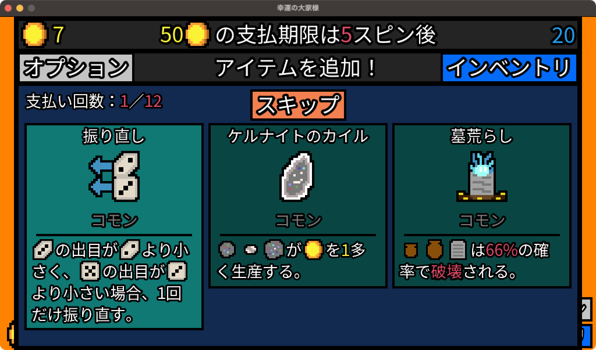
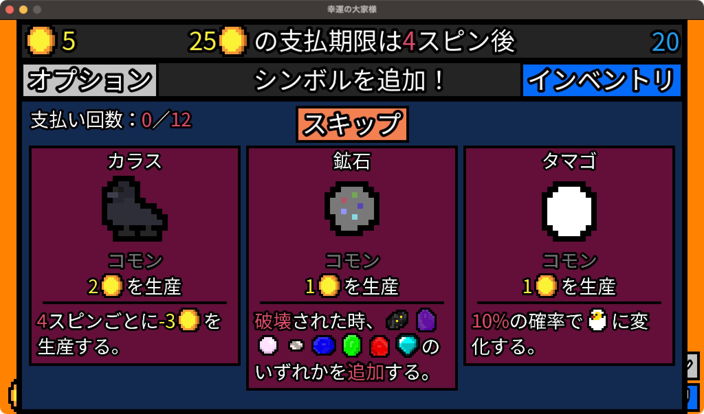
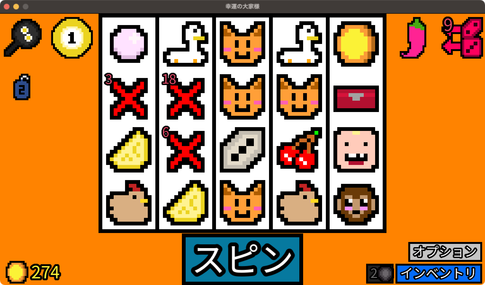
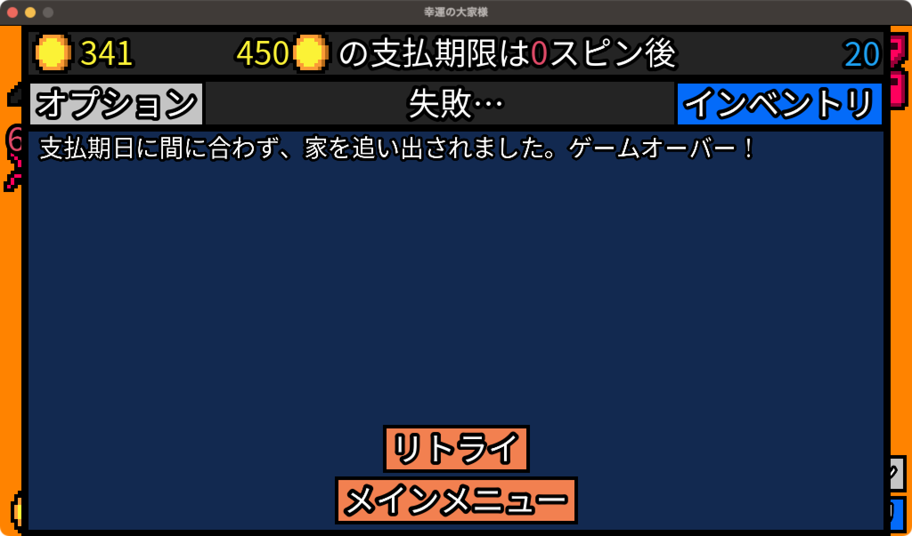
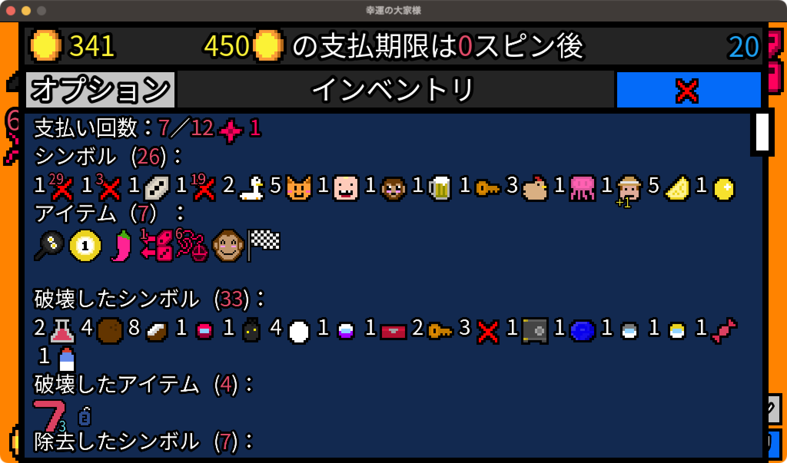

# 今日も大家に家賃を支払う
## はじまり
午前1時、それはポケモンスリープをやっている人は皆新しいポケモンの寝顔を見るために寝ていると言っても過言ではない時間。
そんな時間におもむろにノートPCを立ち上げ、日課となってしまった活動を行う。
それは、大家への家賃の支払い。
正確な事実のみを書くのであれば、幸運の大家様(Luck be a Landlord)[^1]というゲームを遊ぶことである。
ここはそんな日常を切り取り、書き残す。
[^1]:https://store.steampowered.com/app/1404850/

## 幸運の大家様とは？
書き置きの前に、幸運の大家様について豆粒ほども知らない諸君のためにどんなゲームかを軽く説明する。
このゲームは、一般的なゲームのジャンルで言うのであれば、ローグライクデッキ構築ゲームである。

ゲームでは、自分は大家にアパートを借りた人間となる。
大家からは、目の前にスロットマシンがあること、5スピン後に25コインを請求することのみが伝えられる。
そう、我々はこのスロットマシンでお金を稼ぎ、家賃を払うことに邁進するのである。

とはいえ、スロットマシンを見ても、最初はコイン、パール、ネコ、チェリー、花、そして難易度によって❌️があるくらいしかない。

この状態でスピンを行うとどうなるか。
1コイン減り、スロットマシンが回り。
そして、コイン、パール、ネコ、チェリー、花からそれぞれ1コインずつ手元に加わる。
そして、3択の選択画面が出てくることになる。

勘の良い人であればもうおわかりであろう。
この表示されてるシンボルを選ぶと、スロットマシンに追加される。
毎回転ごとにこの選択肢が現れるので、様々な効果があるシンボルを追加していき、大家から課される家賃を支払っていくのである。

しかしながら、ただシンボルを追加していくだけでは大家へ家賃を払い切ることはできない。
それはなぜか。
その答えも単純明快だ。
大家は家賃をだんだん上げていくからである。

日本の法律であれば、家賃の値上げは双方の合意が必要であるため、拒否することができるが、このゲーム上ではそうはいかない。
家賃の値上げに間に合うよう、粛々とコインを稼ぎ続けなければ、家がなくなっておしまいである。
いかにしてこの脅威に対峙するか。
もちろん、シンボルだけでは心もとない。

しかし、幸いにもスロットマシンはシンボルでの稼ぎだけではなく、アイテムという存在がある。

このアイテムは、家賃を支払うタイミングで選ぶことができ、シンボルの効果を伸ばしたり、単純にお金を稼いでくれたりといった様々な効果がある。
シンボルとアイテム、それにエッセンスといったものの力を借りて、大家に立ち向かっていくのがこのゲームである。

それでは、とある日の挑戦について見てもらおう。

## 12月7日の挑戦
### 方針決め
最初の3つはこちら。

最初の5回はシンボルをスキップしまくるといったことをしなければ達成できる。
そのため、方針決めに適したタイミングである。
最初のラインナップから今回の方針を決めていこう。

カラスは、2-2-2-(-1)となり4回転で5コインが稼げるシンボルである。
最初の5シンボルは1回転1コインのため、それらよりは少しだけ稼ぎが多い。
影響があるアイテムは、記憶の限りでは、鳥小屋(鳥系シンボル常時+1コイン)、脱税(マイナスの稼ぎとなった場合+1コイン)あたりか。
あまり多くない。

続いて、鉱石。1回転1コインだが、鉱夫(鉱石を破壊し20コイン)などに破壊されると、いくつかの鉱物のうちどれかが代わりに追加される。
アイテムは、ケルナイトのカイル(鉱石等常時+1コイン)、ツルハシ(鉱石が破壊されると10コイン)など。
破壊というアクションが必要だが、破壊されたときに効果が出やすいなど未来が見える。

そして、タマゴ。こちらも1回転1コインだが、10%の確率で勝手にヒヨコに変化する。
そのヒヨコは10%の確率で1回転2コインのニワトリになり、ニワトリは5%の確率でタマゴを生む。
1%の確率で1回転4コインの金のタマゴを生むこともある。
影響があるアイテムは、カラス同様鳥小屋があるほか、ニワトリ小屋(タマゴ系列を常時+2コイン)もある。
また、ニワトリとして使わない、タマゴを回収するタマゴの容器、タマゴとミルクなどが隣り合うとタマゴが1回転3コインのオムレツに変化するフライパンなど多い。

こう書くとタマゴが良さそうに見えるが、タマゴは自動で増えやすいため、偏ってしまうと1シンボルで1コインにしかならず、将来に暗雲が垂れ込める可能性がある。

色々考えた末、今回はタマゴを選択する。
こういった判断を逐次行っていき、今回も家賃の支払いを目指すことになる。

### 途中経過
しばらくゲームを進めた途中経過がこちら。

最初のアイテムとして、シナジーがあるフライパンが出てきたことにより、卵関連を積極的に集めていた。
巣箱関連が出たら更に良い循環が生まれそうだったため、金のタマゴを生むというシナジーがあるガチョウも選択。
その他、盤面は20マスしかないため、シンボル破壊が可能な幼児、サル、アイテムが多いネコを優先的に取った結果、盤面のようなかたちとなった。

このあたりで、シンボル削除も行う。
家賃の支払いごとに、稀に除去トークンがもらえる。
この除去トークンを使うことで、アイテムの除去が可能となる。
今回は、シナジーがほぼないコイン、チェリー、パール等を除去していきたい。
コインはアイテムでも除去が行われる可能性があるため、パールとチェリーの除去を行った。

これらの操作によって、最難関の20階で１つ目の山と言われている、家賃300コインを超えた。
しかし、ここからが苦しい道のりである。
次は8回転で375コインが必要となる。
1盤面20マスなので、8回転では160マス分。
1マス2コイン以上は確実に必要になることになる。

### そして…
終わりは突然訪れた。
家賃375コインは最終回転で金庫が鍵で開き上手く超えたものの、次の家賃450コインであえなく追い出されてしまった。

オムレツ作戦はある程度上手く行き、5オムレツとなった。
1回転3コインのほか、オムレツと隣り合ったら+2コインのため、増えれば増えるほど稼ぎやすくなる。
しかし、上手くいかなかった。
今回の敗北要因はネコの獲得だと考える。
ネコは強化があるアイテムが多いので、バラバラに他のを獲得するよりかはと積極的にピックアップしたのだが、結局最後まで1コインのままだった。
20シンボルまでしかコイン獲得とならないため、ネコが枠を圧迫してしまった可能性が高い。
うまく調整すべきであったと思われる。

## 終わりに
今回はうまくいかず、追い出されたかたちとなったが、次は上手くいくだろう。
どんな戦略がいいだろう。次は鉱石で稼いでいきたいな、やっぱりフルーツで稼いでみたいかも。
そう色々考えてしまうと、リトライに手が伸びてしまう。
中毒みたいなものだ。

このゲームは、Steamだけでなく、iOSやAndroidでも出ているので、スキマ時間にお手軽に楽しめる。
自分はSteamで回数系以外のアチーブメントをコンプリートしたのにも関わらず、iOS版をイチからやり直してしまっている。
中毒みたいなものだ。

諸君もこの幸運の大家様で遊ぶときには注意してほしい。